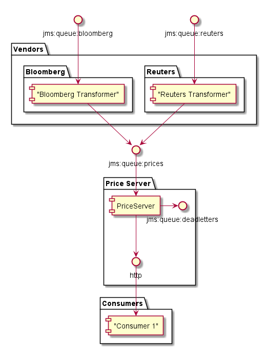
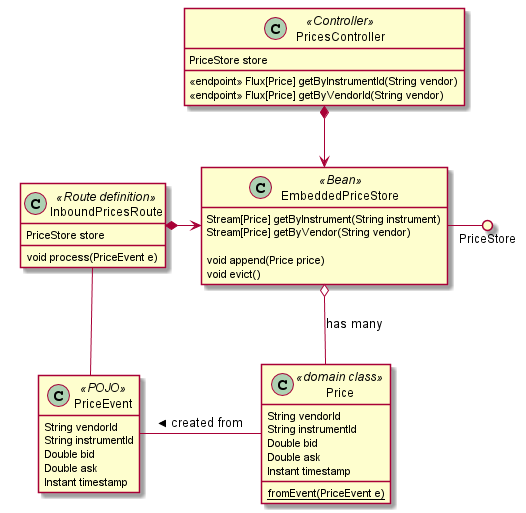
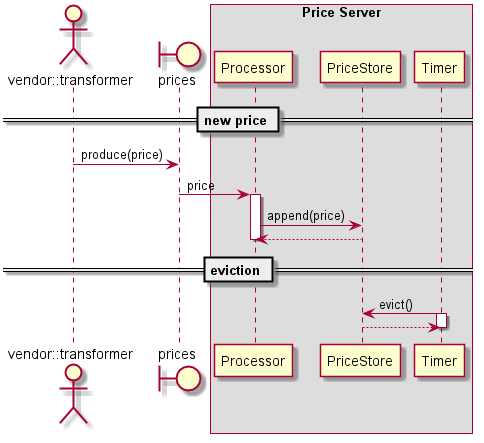
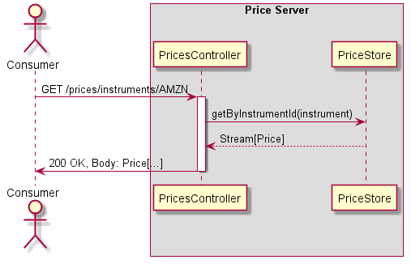

# Price Server

## High level design and Context



The Price Server has been defined as a stand alone service, its main responsibility
being that of obtaining prices as submitted by vendors and expose them through
a rest interface for downstream consumers.

In this sample, only a naive implementation of the cache has been provided, no effort
has been spent on making the provided implementation to be scalable since it is just
for demo purposes, and in reality a real Cache store would be provided (like Redis or maybe ehCache)

In terms of Enterprise integration patterns, I've ended using Apache Camel after giving
Spring Integration a try and finding it a challenge finding proper documentation/samples
on their typed/java8 api (This challenge has proven true with Camel too to be fair,
but at was much easier to get going for the first few steps).

Spring Boot has been used for the rest api since it allows to get up and running
pretty quickly, which in this case was deemed convenient.
I wanted to explore whether the rest endpoints could be achieved without the need
of Spring boot and with a specific HTTP Camel route but I didn't have the time to look into it
as I'd have liked to.

## Challenges

Main challenges were on finding the right balance in terms of scope, I'll always try to
provide a naive implementation of any sort of software I work on and then iterate over it
as the domain and context are discovered.

In the context of an interview process as this, the balances get a bit skewed but still I tried to stick
to being naive and simplicity over flashiness.

Other than that, my main issue was a combination of not having used Spring or Camel for some time
since I've been working on different technologies or different kind of components for the past year at least.
So there was a lot of googling involved into how to do basic things, and what I found is that 
there are lots of resources on the web for old versions or "legacy" ways of achieving things (like xml based config)
and very little examples for using the java-dsls. This was particularly true for Spring Integration as I briefly explained above.

The Camel documentation is slightly better, and it feels the adoption is higher (going by stackoverflow at least).
Their doc pages are being migrated and are also out of date in many areas or the format is broken, but I found their git repo to have
more relevant examples in comparison to Spring Integration.

### Domain and Class Diagram

The domain was kept simple and is quite boring (a single class - as I mentioned before I will strive to be naive
until there is a clear indication that the naive implementation will not hold up) and I've commented on the javadoc on how this could be enhanced.

Given the domain model is on the thin side, I have provided a class diagram for the component as a whole:



### Main flows, Sequence Diagrams

#### Prices into the system and Eviction



#### Consumers



### Upstream and Vendors

Although they have been left out of the exercise, vendor specific formats and validations
are expected to be represented with simple upstream stand-alone components, following the approach:

1. Vendor publishes into --> queue://vendor-id
2. Processor picks messages from queue and parses/validates the message
3. Valid messages are republished into --> queue://prices
4. Optionally the original message could be broadcasted on a topic for other interested consumers
5. Invalid messages are sent to queue://vendor-id:deadletters

Assuming a Camel route, they would look something like this:

```java
errorHandler(
    deadLetterChannel("jms:queue:reuters:deadletters")
);

from("jms:queue:reuters")
    .transform()
        .body(this::doProcess)
    .to("jms:queue:prices");
```

## Interfaces

### Rest Interface

The service exposes two endpoints. These can be extended either via query string
to provide more functionality like providing only the latest prices or allowing filtering with time ranges) if required.

The endpoints are:
* http://localhost:8080/prices/instruments/:instrument
* http://localhost:8080/prices/vendors/:vendor

Additional care needs to be taken to engineer a proper RESTful api, concerns like
versioning of endpoints have not been implemented but the traditional approaches are either
adding a version marker on the endpoint (like /*v1*/prices/instruments/ etc) or take a
header value that allows clients to specify which version they are prepared to consume.
This is important since once there are consumers downstream, iterating over the interface 
needs to be done in a backwards compatible manner.

For a simple interface as the one in this service, and RPC approach over REST is acceptable.
If it is expected to expose a richer interface then Hypermedia/HATEOAS are good
approaches as to enhance contextual discoverability for the exposed resources.

Samples:
```bash
> curl http://localhost:8080/prices/instruments/MSFT -s
[]

> curl http://localhost:8080/prices/vendors/bloomberg  -s
[]
```

Additional sample on this functionality can be found in the PriceServerTest which applies
behaviour style testing to hit a real running service and return prices as a user would do.

### JMS Inbound Prices queue and Deadletters

A route defines the main entrypoints used by this service, these being

1. Eviction timer, can be configured through the `priceserver.eviction.uri` property.
2. Inbound prices, can be configured through the `priceserver.mailbox.uri` property.

Both provide a sensible default, the mailbox being set to read from `queue://prices` so don't need to be defined to run.
Any errors in processing events will be sent to `queue://deadletters`.

### Extension points for future use cases

Add a topic, or move the prices queue to be a durable topic or do routing between the topic and the prices queue if
there are consumers that would need to receive real-time information after recovering a snapshot.

In this case it would be also desirable to add headers to the messages so that consumers
can apply some basic level of selection on the messages they are interested in receiving.

## Non Functional Considerations

### Recovery

Recovering state after a crash or if the system needs to be restarted is fully dependant
on the cache implementation.
If using Redis for example, then the state can be rebuilt using their Append only file that redis provide in case of cache failures.
and would leave our component being stateless.

In the case the desired cache implementation would not support restoring from a snapshot, then we
could wrap the specific `PriceStore` implementation with something that also syncs to a database (or similar).

Given a problem reaching the external cache (a network partition or the cache goes down) the current route
 implementation will give up pretty easily, this would need finer tuning in a real use case
 and either retries or not removing the message from the queue would be more sensible options.

This would mean trying to segregate between different types of exceptions, an invalid message would go
 straight to `deadletters` while a connectivity error should be retried/not removed from the queue.

### Resilience and Scaling up

Since our component is just integration between our upstream processors and the cache implementation,
adding more instances listening on the same queue would suffice. If one of the
instances die, then the other can cover for it until it is recovered.

Samewise if we are not able to keep up with the amount of messages, we can add more instances
to try to get more throughput.

### Monitoring / Metrics

Operational metrics have not been added, I would consider metrics like these:

* Measuring the time for GET requests
* Measuring the time to lookup prices in the cache
* Measuring the time to append prices in the cache
* Rate of Prices coming in
* Measuring the hit rate of Eviction
* Measuring the time of eviction
* Monitoring on deadletter messages

Also operational endpoints to know whether the system is alive and healthy
where not added, these are particularly useful if the application is hosted 
in an environment that can take actions by polling on the state of the app (like kubernetes)
Spring Boot provides these services through the `actuator` dependency.

## Running the Project / Demo

### Requirements

* maven 3.3.x
* java 1.8

### Docker environment

A sample docker environment has been provided, this includes a virtual network
with the following services:

* ActiveMQ broker
* PriceServer instance pointing to the ActiveMQ server

The project and docker image can be built by executing:

```bash
    mvn clean package
    docker-compose up --build -d
```

If the steps above are successful, then you can reach the price server at http://localhost:8080/prices/vendors/bloomberg/,
the broker management site is also available at http://localhost:8161/ 

* username: admin 
* password: admin

If the ports are in use in your system you can modify the mappings in `docker-compose.yml`

You can publish some messages (the current cache will allow duplicates), by going to
http://localhost:8161/admin/send.jsp?JMSDestination=prices&JMSDestinationType=queue

And sending a message like the below:
```json
{"vendorId": "Bloomberg", "instrumentId": "AAPL", "bid": 1002.1, "ask": 1000.1, "timestamp": 1541019061}
```

Sending invalid json will move the message to dead letters

If you want to see the logs, these can be tailed by executing:
```bash
docker-compose logs -f price-server
```
